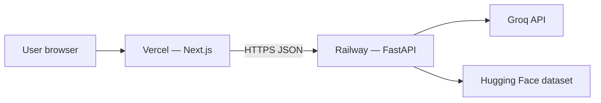

# Deployment Plan: Railway (Backend) + Vercel (Frontend)

Production target for **ZM**: FastAPI on [Railway](https://railway.com), Next.js on [Vercel](https://vercel.com).

Repository: [Somu639/Zomato-Final](https://github.com/Somu639/Zomato-Final)

---

## Architecture



| Component | Host | URL (example) |
|-----------|------|----------------|
| Frontend | Vercel | `https://zomato-final.vercel.app` |
| Backend API | Railway | `https://zm-api-production.up.railway.app` |
| Secrets | Railway env only | `GROQ_API_KEY` never in Vercel |

---

## Part 1 — Backend on Railway

### 1.1 What gets deployed

- Entry: `backend/main.py` → `uvicorn backend.main:create_app --factory`
- Config: [`railway.toml`](../railway.toml), [`Dockerfile`](../Dockerfile), [`Procfile`](../Procfile)
- Build: Docker image (`python -m pip install -e .` inside `Dockerfile`)
- Data: loads from cache if present; otherwise downloads in a **background thread** after the server starts (deploy health check stays fast)

### 1.2 Create the service (Dashboard)

1. [Railway Dashboard](https://railway.com/new) → **Deploy from GitHub repo** → **Somu639/Zomato-Final**, branch `main`.
2. **Root directory**: leave empty (repository root — not `frontend/`).
3. Railway builds from the root [`Dockerfile`](../Dockerfile) (see `railway.toml`).

| Setting | Value |
|---------|--------|
| **Builder** | Dockerfile (auto via `railway.toml`) |
| **Start Command** | From Dockerfile `CMD` (uvicorn on `$PORT`) |
| **Health Check** | `/health` |

4. **Variables** (Railway → service → Variables):

| Key | Required | Example / notes |
|-----|----------|-----------------|
| `GROQ_API_KEY` | Yes (for AI rankings) | From Groq console |
| `CORS_ORIGINS` | Yes | `https://your-app.vercel.app` (set after Vercel deploy) |
| `WEB_HOST` | Recommended | `0.0.0.0` |
| `DATASET_CACHE_DIR` | No | `data/cache` |
| `LOG_LEVEL` | No | `INFO` |
| `GROQ_MODEL` | No | `llama-3.3-70b-versatile` |

Railway sets `PORT` and `RAILWAY_ENVIRONMENT` automatically.

5. **Generate domain**: Settings → Networking → **Generate Domain**.

### 1.3 Verify backend

Open `https://YOUR-SERVICE.up.railway.app/docs` in a browser (root `/` redirects to Swagger).

```bash
curl https://YOUR-SERVICE.up.railway.app/health
curl https://YOUR-SERVICE.up.railway.app/api/v1/locations
```

Root `/` returns JSON with `status: "ok"` when requested with `Accept: application/json` — that is **not** an error.

First deploy may return `"data_loaded": false` for 1–2 minutes while the dataset downloads in the background.

### 1.4 Railway notes

| Topic | Guidance |
|-------|----------|
| **Ephemeral disk** | Cache is rebuilt on redeploy unless you attach a [Railway Volume](https://docs.railway.com/guides/volumes) at `data/cache` |
| **Build failures** | Check logs; ensure root directory is repo root and `pip install -e .` succeeds |
| **PORT** | Railway injects `$PORT`; start command must bind to it |
| **Monorepo** | Do not set root to `frontend/` for the API service |

---

## Part 2 — Frontend on Vercel

### 2.1 Create the project

1. [Vercel Dashboard](https://vercel.com/new) → Import **Somu639/Zomato-Final**.
2. **Root Directory** → `frontend`.
3. **Environment variable**:

| Key | Value |
|-----|--------|
| `NEXT_PUBLIC_API_BASE_URL` | `https://YOUR-SERVICE.up.railway.app` (no trailing slash, no `/api`) |

4. Deploy.

### 2.2 Local dev

Leave `NEXT_PUBLIC_API_BASE_URL` empty; `next.config.ts` proxies `/api` to `http://127.0.0.1:8000`.

---

## Part 3 — Wire CORS

After Vercel gives you a URL, set on Railway:

```env
CORS_ORIGINS=https://your-project.vercel.app
```

Redeploy or wait for Railway to restart the service.

---

## Part 4 — Checklist

### Backend (Railway)

- [ ] Service deployed from repo root on `main`
- [ ] Docker build from root `Dockerfile` succeeds
- [ ] Public domain generated
- [ ] `GROQ_API_KEY` set
- [ ] `/health` returns 200
- [ ] `CORS_ORIGINS` includes Vercel URL

### Frontend (Vercel)

- [ ] Root directory = `frontend`
- [ ] `NEXT_PUBLIC_API_BASE_URL` = Railway HTTPS URL
- [ ] End-to-end: form → recommendations

---

## Part 5 — Environment matrix

| Variable | Railway | Vercel | Local |
|----------|---------|--------|-------|
| `GROQ_API_KEY` | ✅ | ❌ | `.env` |
| `CORS_ORIGINS` | ✅ | ❌ | `.env` |
| `NEXT_PUBLIC_API_BASE_URL` | ❌ | ✅ | `frontend/.env.local` |
| `DATASET_CACHE_DIR` | ✅ | ❌ | `data/cache` |
| `PORT` | ✅ (auto) | ❌ | `WEB_PORT` |

---

## Part 6 — Troubleshooting

| Symptom | Likely cause | Fix |
|---------|----------------|-----|
| Deploy failed / health timeout | Build blocked on dataset download | Use latest `main` (background prefetch) |
| **`pip install -e .` exit code 127** | Nixpacks had no `pip` on PATH | Use root `Dockerfile` build (current `main`) |
| **Root shows `zm-restaurant-api` JSON** | Normal API root (not an error) | Open `/docs` or `/api/v1/locations`; wait if `data_loaded` is false |
| **`data_loaded: false` on `/health`** | First deploy downloading dataset | Wait 1–3 min; recheck `/health` |
| `{"detail":"Not Found"}` on `/api/v1/*` | Wrong start command or legacy `zm serve` | Use uvicorn start command above |
| `NEXT_PUBLIC_API_BASE_URL` ends with `/api` | Double path → 404 | Use Railway domain only |
| CORS error | Missing Vercel URL in `CORS_ORIGINS` | Update Railway variables |
| `data_loaded: false` | Cache still downloading | Wait 1–2 min; check Railway logs |
| Groq fallback only | Missing `GROQ_API_KEY` on Railway | Set variable in Railway |
| **Bad credentials** / **repository not authorized** | [GitHub app token incident](https://www.githubstatus.com/incidents/k5z4d1v1tqmt) or stale Railway/Vercel ↔ GitHub link | See **Part 7** below (CLI deploy bypasses this) |

---

## Part 7 — GitHub app auth errors (Railway / Vercel)

If Railway or Vercel shows **Bad credentials**, **repository not authorized**, or fails to connect the repo, this is usually a **GitHub-side** issue with **GitHub App installation tokens** (not your code). Check [GitHub Status](https://www.githubstatus.com/).

Your repo and `git push` can still work while dashboard deploy fails. Use one of these **workarounds** until GitHub recovers or you reconnect the app.

### Option A — Deploy backend with Railway CLI (recommended bypass)

Deploys from your machine; **does not use** the broken GitHub app token.

```powershell
# One-time: install CLI
npm install -g @railway/cli

# Login (opens browser)
railway login

# From repo root
cd c:\Users\din17512\Music\ZM

# New project, or link an existing one
railway init
# OR: railway link

# Set secrets (repeat for each variable)
railway variables set GROQ_API_KEY=your-key
railway variables set CORS_ORIGINS=https://your-app.vercel.app
railway variables set WEB_HOST=0.0.0.0

# Deploy current directory
railway up

# Public URL
railway domain
```

After deploy, copy the Railway URL into Vercel as `NEXT_PUBLIC_API_BASE_URL`.

### Option B — Reconnect GitHub when status is green

1. [GitHub Status](https://www.githubstatus.com/) — wait until **GitHub.com** / **API** are operational.
2. **GitHub** → Settings → **Applications** → **Installed GitHub Apps** → **Railway** → Configure → ensure **Somu639/Zomato-Final** is allowed → Save.
3. **Railway** → Project → **Settings** → disconnect GitHub → connect again → select repo + branch `main`.
4. **Redeploy** from Railway dashboard.

Same pattern for **Vercel**: Settings → Git → Disconnect → reconnect repo.

### Option C — Deploy frontend with Vercel CLI

If Vercel GitHub import fails:

```powershell
npm install -g vercel
cd c:\Users\din17512\Music\ZM\frontend
vercel login
vercel --prod
# Set NEXT_PUBLIC_API_BASE_URL when prompted or in Vercel dashboard
```

### Option D — Confirm repo access (local)

```powershell
git ls-remote https://github.com/Somu639/Zomato-Final.git HEAD
```

If this succeeds, the repo is fine; retry dashboard deploy or use CLI (Option A/C).

---

## Related docs

- [PhaseWiseArchitecture.md](./PhaseWiseArchitecture.md)
- [README.md](../README.md)
- [frontend/.env.example](../frontend/.env.example)
