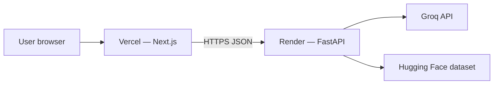

# Deployment Plan: Render (Backend) + Vercel (Frontend)

Production target for **ZM**: FastAPI on [Render](https://render.com), Next.js on [Vercel](https://vercel.com). Streamlit is **not** part of this deployment path.

Repository: [Somu639/Zomato-Final](https://github.com/Somu639/Zomato-Final)

---

## Architecture



| Component | Host | URL (example) |
|-----------|------|----------------|
| Frontend | Vercel | `https://zomato-final.vercel.app` |
| Backend API | Render | `https://zm-api.onrender.com` |
| Secrets | Render env only | `GROQ_API_KEY` never in Vercel |

---

## Prerequisites

1. GitHub repo connected to both platforms (same repo, branch `main`).
2. [Groq API key](https://console.groq.com).
3. Local smoke test: `zm load-data`, `zm api`, `cd frontend && npm run dev`.

---

## Part 1 — Backend on Render

### 1.1 What gets deployed

- Entry: `backend/main.py` → `uvicorn backend.main:create_app --factory`
- Python package: `src/zm` + `backend/` (installed via `pip install -e .` from root `requirements.txt`)
- Data: built during deploy with `zm load-data` (downloads Hugging Face CSV → `data/cache/`)

Config file in repo: [`render.yaml`](../render.yaml) (optional [Blueprint](https://render.com/docs/blueprint-spec)).

### 1.2 Create the web service (Dashboard)

1. [Render Dashboard](https://dashboard.render.com) → **New** → **Web Service**.
2. Connect **Somu639/Zomato-Final**, branch `main`.
3. Settings:

| Field | Value |
|-------|--------|
| **Name** | `zm-api` (defines default hostname) |
| **Region** | Singapore (or closest to users) |
| **Root Directory** | *(leave empty — repo root)* |
| **Runtime** | Python 3 |
| **Build Command** | `pip install -e . && zm load-data` |
| **Start Command** | `uvicorn backend.main:create_app --factory --host 0.0.0.0 --port $PORT` |
| **Health Check Path** | `/health` |

4. **Environment variables** (Render → Environment):

| Key | Required | Example / notes |
|-----|----------|-----------------|
| `GROQ_API_KEY` | Yes (for AI rankings) | From Groq console |
| `CORS_ORIGINS` | Yes | `https://your-app.vercel.app` (set after Vercel deploy) |
| `PYTHON_VERSION` | Recommended | `3.11.9` |
| `WEB_HOST` | Yes on Render | `0.0.0.0` |
| `DATASET_CACHE_DIR` | No | `data/cache` |
| `LOG_LEVEL` | No | `INFO` |
| `GROQ_MODEL` | No | `llama-3.3-70b-versatile` |

5. Deploy. First build may take **5–15 minutes** (dataset download).

### 1.3 Verify backend

```bash
curl https://zm-api.onrender.com/health
curl https://zm-api.onrender.com/api/v1/locations
```

Open `https://zm-api.onrender.com/docs` for OpenAPI.

### 1.4 Render notes

| Topic | Guidance |
|-------|----------|
| **Free tier** | Service sleeps after inactivity; cold start ~30–60s. |
| **Disk** | Ephemeral; `zm load-data` on each deploy rebuilds cache. For faster restarts, use a [persistent disk](https://render.com/docs/disks) mounted at `data/cache`. |
| **Build failures** | Check Hugging Face access and build logs; retry deploy. |
| **PORT** | Render sets `$PORT`; start command must bind to it (not fixed `8000`). |

### 1.5 Blueprint deploy (optional)

From repo root (with [Render CLI](https://render.com/docs/cli) or Dashboard **Blueprint**):

```bash
# Uses render.yaml in repository
```

Sync `CORS_ORIGINS` in Dashboard after you know the Vercel URL.

---

## Part 2 — Frontend on Vercel

### 2.1 What gets deployed

- Root directory: **`frontend/`** (not repo root).
- Framework: **Next.js** (auto-detected).
- Production API calls use **`NEXT_PUBLIC_API_BASE_URL`** → Render backend (browser calls API directly; no server rewrite in prod).

Config: [`frontend/vercel.json`](../frontend/vercel.json), [`frontend/.env.example`](../frontend/.env.example).

### 2.2 Create the project (Dashboard)

1. [Vercel Dashboard](https://vercel.com/new) → Import **Somu639/Zomato-Final**.
2. **Root Directory** → `frontend`.
3. Framework Preset: **Next.js** (default).
4. **Environment variables**:

| Key | Value |
|-----|--------|
| `NEXT_PUBLIC_API_BASE_URL` | `https://zm-api.onrender.com` (your Render URL, no trailing slash) |

5. Deploy.

### 2.3 Verify frontend

1. Open `https://<your-project>.vercel.app`.
2. City dropdown should load (calls Render `/api/v1/locations`).
3. Submit preferences → recommendations appear.

If the dropdown is empty, check browser Network tab (CORS or wrong API URL).

### 2.4 Vercel notes

| Topic | Guidance |
|-------|----------|
| **Env vars** | Only `NEXT_PUBLIC_*` are exposed to the browser; never put `GROQ_API_KEY` here. |
| **Preview deployments** | Each PR gets a URL; add that origin to Render `CORS_ORIGINS` if you test previews. |
| **Local dev** | Leave `NEXT_PUBLIC_API_BASE_URL` empty; `next.config.ts` proxies `/api` to `http://127.0.0.1:8000`. |

---

## Part 3 — Wire CORS (required)

After Vercel gives you a URL, update Render:

```env
CORS_ORIGINS=https://your-project.vercel.app,https://your-project-*.vercel.app
```

Render does not support wildcards in all setups; for preview branches, add each preview origin or use your primary production URL only.

Redeploy or save env (Render restarts the service).

---

## Part 4 — Deployment checklist

### Backend (Render)

- [ ] Web service created from `main`
- [ ] Build: `pip install -e . && zm load-data` succeeds
- [ ] Start: uvicorn on `$PORT`
- [ ] `GROQ_API_KEY` set
- [ ] `/health` returns `data_loaded: true` after build
- [ ] `CORS_ORIGINS` includes Vercel production URL

### Frontend (Vercel)

- [ ] Project root = `frontend`
- [ ] `NEXT_PUBLIC_API_BASE_URL` = Render API URL
- [ ] Production build passes
- [ ] End-to-end: form → recommendations

### Post-deploy

- [ ] Update README with live URLs (optional)
- [ ] Test Groq path (recommendations show `source: groq`)
- [ ] Test without Groq (fallback still returns results)

---

## Part 5 — Environment matrix

| Variable | Render | Vercel | Local |
|----------|--------|--------|-------|
| `GROQ_API_KEY` | ✅ | ❌ | `.env` |
| `CORS_ORIGINS` | ✅ | ❌ | `.env` |
| `NEXT_PUBLIC_API_BASE_URL` | ❌ | ✅ | `frontend/.env.local` |
| `DATASET_CACHE_DIR` | ✅ | ❌ | `data/cache` |

---

## Part 6 — Troubleshooting

| Symptom | Likely cause | Fix |
|---------|----------------|-----|
| CORS error in browser | `CORS_ORIGINS` missing Vercel URL | Update Render env |
| `data_loaded: false` on `/health` | Build skipped `zm load-data` | Fix build command; check logs |
| 503 on recommendations | Data not loaded | Re-run deploy / build |
| Vercel shows connection error | Wrong `NEXT_PUBLIC_API_BASE_URL` | Must be Render HTTPS URL |
| Slow first request | Render cold start | Expected on free tier |
| Groq fallback only | Missing/invalid `GROQ_API_KEY` on Render | Set secret on Render |

---

## Part 7 — Custom domains (optional)

| Service | Steps |
|---------|--------|
| **Vercel** | Project → Settings → Domains → add `app.yourdomain.com` |
| **Render** | Service → Settings → Custom Domain → `api.yourdomain.com` |
| **DNS** | CNAME records per provider docs |
| **CORS** | Set `CORS_ORIGINS=https://app.yourdomain.com` |

Update `NEXT_PUBLIC_API_BASE_URL` to your custom API domain.

---

## Related docs

- [PhaseWiseArchitecture.md](./PhaseWiseArchitecture.md) — phases 5a/5b/6
- [README.md](../README.md) — local development
- [frontend/.env.example](../frontend/.env.example) — Vercel env template
