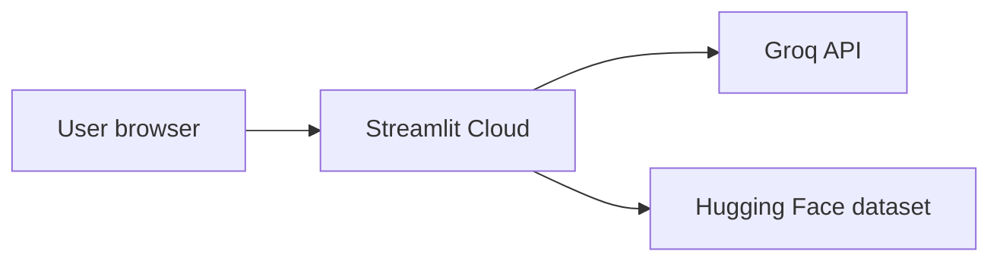

# Deployment: Streamlit Community Cloud

Production target for **ZM**: a single **Streamlit** app that runs the full recommendation pipeline in-process.

Repository: [Somu639/Zomato-Final](https://github.com/Somu639/Zomato-Final)

---

## Architecture



| Component | Host | Notes |
|-----------|------|--------|
| UI + engine | [Streamlit Community Cloud](https://streamlit.io/cloud) | `streamlit_app/app.py` |
| Secrets | Streamlit Secrets only | `GROQ_API_KEY` never in the repo |

---

## Prerequisites

1. GitHub repo on branch `main`.
2. [Groq API key](https://console.groq.com).
3. Local smoke test:

```bash
pip install -e .
python -m zm load-data
python -m zm streamlit
```

Open http://127.0.0.1:8501

---

## Deploy on Streamlit Community Cloud

1. Go to [share.streamlit.io](https://share.streamlit.io) → **Create app**.
2. Connect your GitHub repo, branch **`main`**.
3. **Main file path:** `streamlit_app/app.py`
4. **Advanced settings → Python version:** 3.11 (recommended).

### Secrets (required for AI rankings)

In the app → **Settings** → **Secrets**:

```toml
GROQ_API_KEY = "your-groq-key"
```

### Streamlit Cloud settings

| Setting | Value |
|---------|--------|
| **Main file** | `Home.py` (required) |
| **Python version** | **3.11** in Advanced settings (do not use 3.14 — repo pins `<3.14`) |

The repo includes `.python-version` (`3.11.9`) and `runtime.txt`. If Cloud still uses Python 3.14, set **3.11** manually under Advanced settings.

**Important:** `Home.py` calls `main()` on every rerun so search results appear after you submit the form.

Without `GROQ_API_KEY`, recommendations use the rule-based fallback.

### First deploy

The app downloads the Hugging Face dataset on first run (1–3 minutes). The UI shows **Loading restaurants…**

---

## Local Docker (optional)

```bash
docker compose up --build
```

Opens http://127.0.0.1:8501

---

## Troubleshooting

| Symptom | Fix |
|---------|-----|
| **`ERR_CONNECTION_REFUSED`** | Run `start.bat` or `python -m zm streamlit`; open **http://127.0.0.1:8501** |
| **ModuleNotFoundError: streamlit** | `pip install -e .` from repo root |
| **Empty city dropdown** | Wait for dataset download; check Streamlit logs |
| **Groq errors** | Set `GROQ_API_KEY` in Secrets |
