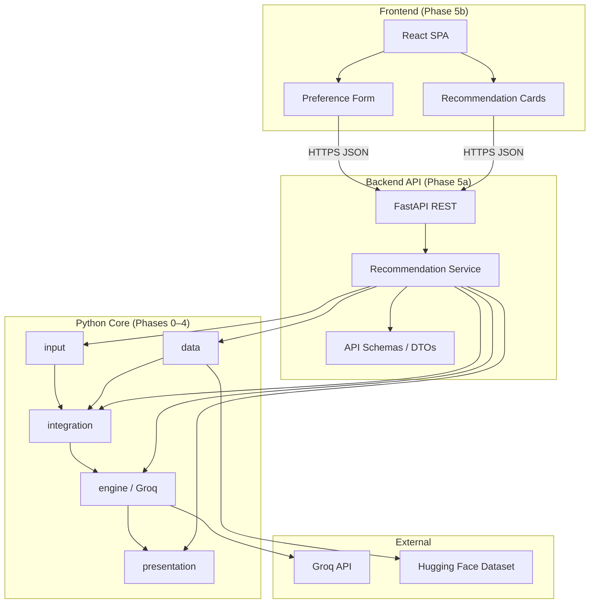
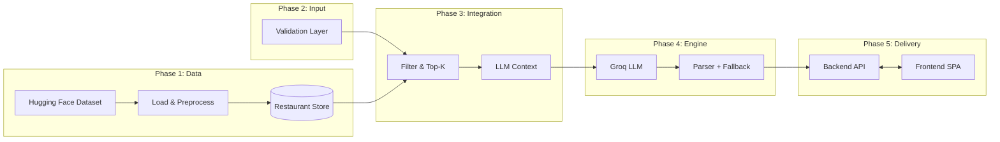
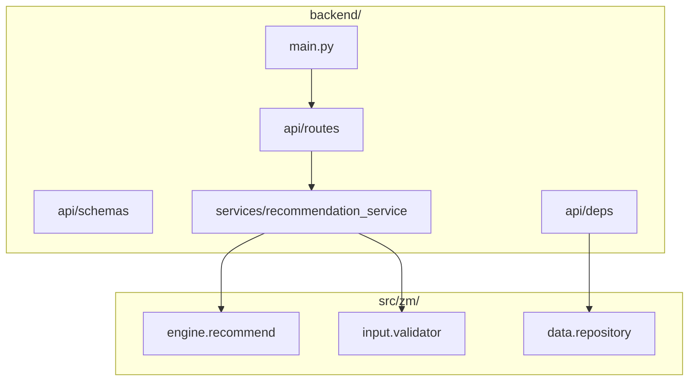
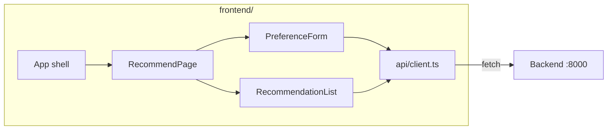
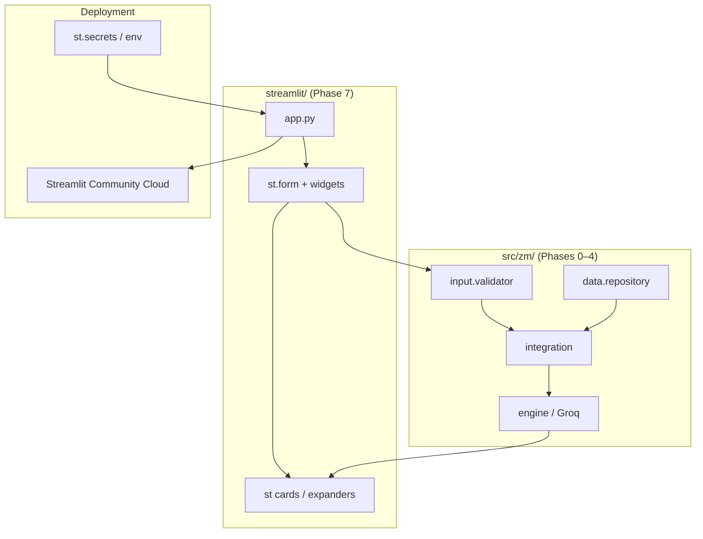
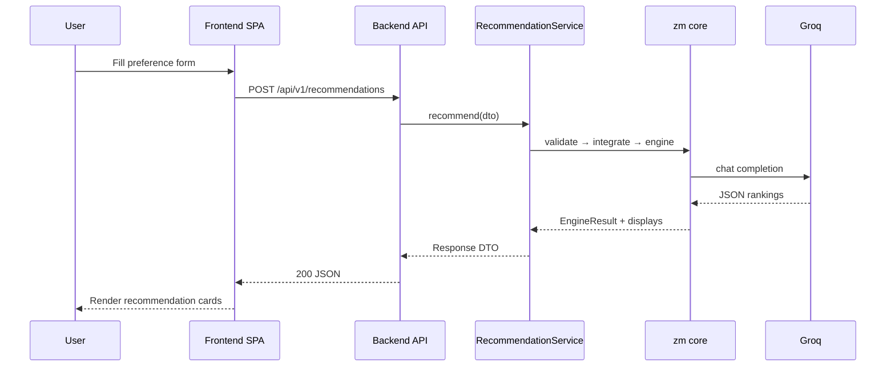
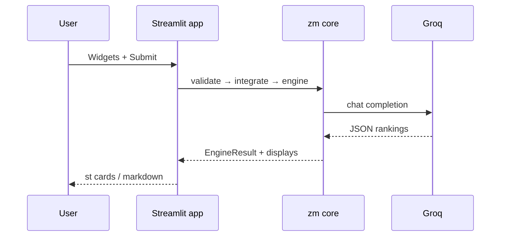
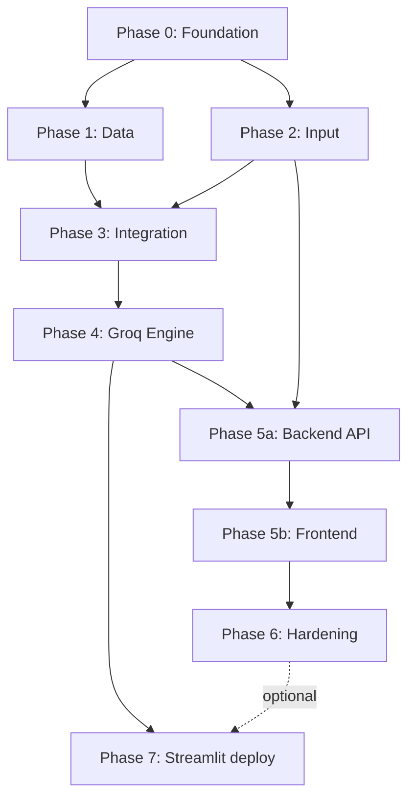

# Phase-Wise Architecture: AI-Powered Restaurant Recommendation System

This document defines a phased architecture for the system described in [Problemstatement1.md](./Problemstatement1.md). Phases **0–4** are implemented in the Python core (`src/zm/`). **Phase 5** introduces a **backend + frontend** split; **Phase 6** adds production hardening; **Phase 7** adds an optional **Streamlit** deployment path for Streamlit Cloud and single-process hosting.

---

## System Architecture (Post Phase 5)

### Target: separated backend and frontend



| Layer | Technology | Responsibility |
|-------|------------|----------------|
| **Frontend** | Next.js + TypeScript (App Router) | UX only: forms, validation display, results, loading/errors |
| **Backend API** | FastAPI | HTTP routes, CORS, request/response mapping, orchestration |
| **Core library** | `zm` Python package | Business logic: data, validation, filters, Groq, enrichment |
| **Data store** | JSONL cache + in-memory repository | Restaurant catalog (Phase 1) |

**Core principle:** Structured data narrows the search space; Groq reasons over a small candidate set. The frontend never calls Groq or reads the dataset directly.

---

## High-Level Phase Flow (Logical)



---

## Phase Overview

| Phase | Name | Primary outcome | Depends on |
|-------|------|-----------------|------------|
| 0 | Foundation | Repo, config, contracts | — |
| 1 | Data ingestion | Clean restaurant records in repository | Phase 0 |
| 2 | User input | Validated `UserPreferences` | Phase 0 |
| 3 | Integration layer | Filtered candidates + LLM context | Phases 1, 2 |
| 4 | Recommendation engine | Groq-ranked list + explanations | Phase 3 |
| 5a | Backend API | REST API orchestrating core | Phases 1–4 |
| 5b | Frontend | SPA consuming REST API | Phase 5a |
| 6 | Hardening (optional) | Docker, cache, observability | Phases 1–5 |
| 7 | Streamlit deployment | Hosted demo / single-process app | Phases 1–4 (5a optional) |

**Current implementation status**

| Phase | Status | Location |
|-------|--------|----------|
| 0–4 | Implemented | `src/zm/` |
| 5a | Implemented | `backend/` — FastAPI REST API |
| 5b | Implemented | `frontend/` — UI (migrated to Next.js in Phase 6) |
| 6 | Implemented | Docker Compose, cache, rate limits, observability, INR budget |
| 7 | Implemented | `streamlit_app/` — Streamlit Cloud / self-hosted (`zm streamlit`) |
| 5 (interim / legacy) | Available | `src/zm/web/` (monolithic FastAPI + Jinja, `zm serve`) |

---

## Phase 0: Foundation

**Goal:** Establish project structure, configuration, and shared contracts so later phases integrate without rework.

### Components

| Component | Responsibility |
|-----------|----------------|
| Project scaffold | Python package `zm`, dependency management |
| Configuration | `GROQ_API_KEY`, dataset cache, API/frontend URLs |
| Domain models | `Restaurant`, `UserPreferences`, `Recommendation`, `RecommendationDisplay` |
| Interfaces | Ports for data source, LLM completer, UI (for tests) |

### Deliverables

- Shared types in `src/zm/models/`
- Documented env vars (see [README](../README.md))
- No UI framework locked in Phase 0 (API + SPA decided in Phase 5)

### Exit criteria

- Phases 1–5a import the same models without circular dependencies

---

## Phase 1: Data Ingestion

**Goal:** Load the Zomato dataset from Hugging Face, normalize it, and expose queryable restaurant records.

*Maps to problem statement: **§1 Data Ingestion***

| Component | Responsibility |
|-----------|----------------|
| Dataset loader | Download `zomato.csv` via Hugging Face Hub |
| Preprocessor | Dedupe, skip invalid rows |
| Field normalizer | Map CSV → `Restaurant` |
| Restaurant repository | `filter_by_location()`, `get_known_locations()`, `get_by_id()` |

**Package:** `src/zm/data/`

### Exit criteria

- ≥1 city returns a non-empty restaurant set
- `zm load-data` builds `data/cache/restaurants_v1.jsonl`

---

## Phase 2: User Input

**Goal:** Collect and validate user preferences before any recommendation runs.

*Maps to problem statement: **§2 User Input***

| Component | Responsibility |
|-----------|----------------|
| Validation layer | `validate_form()` / `validate_json()` → `UserPreferences` |
| Location matcher | Known cities + fuzzy suggestions |
| API schemas | `PreferenceFormInput`, error responses |

**Package:** `src/zm/input/`

### Preference schema

| Field | Type | Validation |
|-------|------|------------|
| `location` | string | Required; known city (e.g. Bangalore); area via `additional` |
| `budget` | enum | `low` \| `medium` \| `high` (numeric budget mapped in UI/API) |
| `cuisine` | string or list | At least one cuisine |
| `min_rating` | float | 0–5 |
| `additional` | string | Optional; area (e.g. Bellandur), free-text prefs, max 500 chars |

### Exit criteria

- Invalid input never reaches filter or Groq
- Same validation used by backend API and frontend (server-side authority)

---

## Phase 3: Integration Layer

**Goal:** Reduce the dataset to a relevant candidate set and build LLM-ready context.

*Maps to problem statement: **§3 Integration Layer***

| Component | Responsibility |
|-----------|----------------|
| Hard filters | Location (city), min rating, cuisine OR-match, budget band |
| Soft scoring | Rank by rating + budget fit before Top-K |
| Context packager | JSON with `restaurant_id`, name, cuisine, rating, cost |
| Prompt templates v1 | System + user prompts for Groq |

**Package:** `src/zm/integration/`

### Exit criteria

- Typical query returns 10–30 candidates in &lt;100ms (local data)
- Zero candidates → clear message, **no Groq call**

---

## Phase 4: Recommendation Engine (Groq)

**Goal:** Use **Groq** to rank candidates, explain fit, and optionally summarize.

*Maps to problem statement: **§4 Recommendation Engine***

| Component | Responsibility |
|-----------|----------------|
| Groq client | `llama-3.3-70b-versatile` (configurable), JSON mode, retry |
| Parser | Strip fences, validate IDs against candidates |
| Fallback | Rule-based Top-N if Groq fails or key missing |
| Enricher | `RecommendationDisplay` for UI/API |

**Package:** `src/zm/engine/`

### LLM provider

| Setting | Default |
|---------|---------|
| `GROQ_API_KEY` | Required for AI rankings |
| `GROQ_MODEL` | `llama-3.3-70b-versatile` |

### LLM output schema

```json
{
  "summary": "Optional one-line overview",
  "recommendations": [
    {
      "restaurant_id": "string",
      "rank": 1,
      "explanation": "Why this matches location, budget, cuisine, and extras"
    }
  ]
}
```

### Exit criteria

- Top N results include explanations grounded in preferences
- Hallucinated `restaurant_id` values are dropped (P4-16)

---

## Phase 5: Backend + Frontend (Target Architecture)

**Goal:** Deliver the product through a **proper REST backend** and a **dedicated frontend SPA**, replacing the interim monolithic `zm/web` template app.

*Maps to problem statement: **§2 User Input** and **§5 Output Display***

---

### Phase 5a: Backend API

**Goal:** Thin HTTP layer that orchestrates the Python core and exposes stable JSON contracts.

#### Components



| Component | Responsibility |
|-----------|----------------|
| `main.py` | FastAPI app, CORS, lifespan (load dataset on startup) |
| Routes | REST endpoints (see below) |
| Service layer | `RecommendationService.recommend()` — single orchestration entry |
| API schemas | Pydantic DTOs mirroring frontend types (decoupled from domain if needed) |
| Dependencies | Repository holder, settings injection |
| Error mapping | 400 validation, 404 no matches, 503 data not loaded, 502 Groq degraded |

#### REST API contract

| Method | Path | Description |
|--------|------|-------------|
| `GET` | `/health` | Liveness + data loaded flag |
| `GET` | `/api/v1/locations` | Known cities for dropdown |
| `GET` | `/api/v1/metadata` | Budget bands, example cuisines |
| `POST` | `/api/v1/recommendations` | Full pipeline → ranked results |

**`POST /api/v1/recommendations` request body**

```json
{
  "location": "Bangalore",
  "budget": "high",
  "cuisines": ["North Indian", "Italian"],
  "min_rating": 4.0,
  "additional": "Prefer Bellandur area. Budget around 2000 for two."
}
```

**Success response (`200`)**

```json
{
  "ok": true,
  "source": "groq",
  "warning": null,
  "summary": "Top picks in Bellandur matching your budget",
  "preferences": { "location": "Bangalore", "budget": "high", "cuisines": ["North Indian", "Italian"], "min_rating": 4.0 },
  "filter_stats": { "location_count": 362, "after_budget": 16, "after_top_k": 16 },
  "recommendations": [
    {
      "restaurant_id": "abc123",
      "rank": 1,
      "name": "MoMo Cafe - Courtyard by Marriott",
      "cuisines": ["Asian", "North Indian"],
      "rating": 4.2,
      "estimated_cost": "₹2,000 for two",
      "explanation": "..."
    }
  ]
}
```

**Error response (`422`)**

```json
{
  "ok": false,
  "errors": { "location": "Did you mean Bangalore?" },
  "message": "Please fix the errors below."
}
```

#### Suggested backend layout

```
backend/
├── main.py                 # FastAPI entry, CORS, mount routes
├── api/
│   ├── routes/
│   │   ├── health.py
│   │   └── recommendations.py
│   ├── schemas.py          # Request/response DTOs
│   └── deps.py             # get_repository, get_settings
└── services/
    └── recommendation_service.py   # calls zm.engine.recommend
```

**Core stays in** `src/zm/` — backend imports `zm` as a library (no business logic duplication).

#### Deliverables

- OpenAPI docs at `/docs`
- CORS configured for frontend origin (e.g. `http://localhost:3000`)
- Startup loads restaurant cache (same as `zm load-data`)

#### Exit criteria

- Frontend can complete full flow using only REST (no server-rendered HTML)
- All five display fields served from JSON per result

---

### Phase 5b: Frontend

**Goal:** Modern SPA for preference input and recommendation display.

#### Components



| Component | Responsibility |
|-----------|----------------|
| Preference form | Location select, budget, cuisines, rating, additional notes |
| API client | `POST /api/v1/recommendations`, typed errors |
| Results view | Cards: name, cuisine, rating, cost, AI explanation, rank |
| UX states | Loading spinner, field errors, empty/no-match, Groq fallback banner |
| Config | `VITE_API_BASE_URL` → backend |

#### Suggested frontend layout

```
frontend/
├── app/
│   ├── layout.tsx
│   ├── page.tsx
│   └── globals.css
├── components/
│   ├── RecommendPage.tsx
│   ├── PreferenceForm.tsx
│   └── ...
├── lib/api/
│   ├── client.ts
│   └── types.ts
├── next.config.ts           # rewrites /api → backend
└── package.json
```

#### UI requirements (problem statement §5)

| Field | Source |
|-------|--------|
| Restaurant name | API / dataset |
| Cuisine | API |
| Rating | API |
| Estimated cost | API |
| AI explanation | Groq (via API) |

#### Deliverables

- Responsive layout (mobile-friendly cards)
- No secrets in frontend (Groq key server-side only)

#### Exit criteria

- User completes flow in browser without CLI or Jinja templates
- Works against backend on localhost (dev) and deployed URL (prod)

---

### Interim MVP (current)

Until Phase 5a/5b are complete, **`src/zm/web/`** provides:

- `GET /` — Jinja form
- `POST /recommendations` — form POST + inline HTML results
- `POST /api/preferences` — partial JSON API

This monolith **implements the same orchestration** as the target backend but mixes presentation and API. Migrate routes to `backend/` and UI to `frontend/` without changing `src/zm/` core logic.

---

## Phase 6: Hardening (Optional)

| Area | Examples |
|------|----------|
| Deployment | Docker Compose: `api` + `web` + volume for `data/cache` |
| Caching | Short TTL cache for identical recommendation requests |
| Observability | Request ID, phase timings, Groq token/latency logs |
| Security | CORS allowlist, rate limits, no API keys in frontend |
| Area filter | First-class Bellandur / area filter in integration |
| Budget UX | Numeric budget (₹2000) mapped to band in API layer |

---

## Phase 7: Deployment with Streamlit

**Goal:** Ship a **single-process, Python-only** deployment path for demos, internal tools, and **Streamlit Community Cloud** (or any host that runs `streamlit run`). The app calls the **`zm` core directly**—no separate Next.js build—while reusing the same validation, filters, and Groq pipeline as Phases 1–4.

*Maps to problem statement: **§2 User Input** and **§5 Output Display** (alternate delivery channel)*

### Why Streamlit (vs Phase 5–6 stack)

| Aspect | Phase 5–6 (Next.js + FastAPI) | Phase 7 (Streamlit) |
|--------|-------------------------------|---------------------|
| Processes | API + web (2+ services) | One Python process |
| Hosting | Docker / VPS / separate front & API URLs | [Streamlit Cloud](https://streamlit.io/cloud), Railway, etc. |
| Best for | Production product UI | Quick deploy, hackathons, stakeholder demos |
| Groq key | Server-side only (API) | Server-side only (`st.secrets` / env) |
| Dataset | Volume / `data/cache` on API host | Same cache; load at app startup |

Streamlit does **not** replace the Next.js product; it is an **additional deployment option** after the core is stable.

### Architecture



**Optional integration mode:** The Streamlit app may call **`backend/` REST** (`POST /api/v1/recommendations`) instead of importing `zm` directly when you want one deployed API and multiple thin clients. Default for Phase 7 is **in-process `zm`** for simplest hosting.

### Components

| Component | Responsibility |
|-----------|----------------|
| `streamlit/app.py` | Entrypoint: `streamlit run streamlit/app.py` |
| `streamlit/pages/` (optional) | Multi-page: Home, About, Admin stats |
| Session state | Cache repository handle, last results, loading flags |
| Preference widgets | `st.selectbox` (city), `st.text_input` (area, cuisines), `st.slider` (rating), budget band or ₹ for two |
| Results | `st.container` / cards: rank, name, cuisine, rating, cost, `st.markdown` explanation |
| Secrets | `GROQ_API_KEY`, `HF_DATASET_ID` via `.streamlit/secrets.toml` (local) or Cloud secrets |
| Data bootstrap | On first run: `build_repository()` if cache exists; sidebar message if `zm load-data` needed |

### Suggested layout

```
streamlit_app/                # Named streamlit_app (avoids PyPI streamlit import clash)
├── app.py                    # Main UI + recommend button
├── service.py                # In-process zm pipeline
├── components/
│   ├── preference_form.py    # Widgets → PreferenceInput
│   └── results.py            # Render EngineResult / cards
└── README.md                 # Deploy steps for Streamlit Cloud

.streamlit/config.toml        # Theme (dark) at repo root
requirements-streamlit.txt
packages.txt                  # Streamlit Cloud → requirements file

# Repo root (deployment)
├── requirements-streamlit.txt  # zm + streamlit (+ optional pins)
└── packages.txt                # Streamlit Cloud: path to requirements
```

### User flow (Streamlit)

1. User opens deployed URL (e.g. `https://<app>.streamlit.app`).
2. Sidebar or main column: city, area, budget (band or ₹), cuisines, min rating, additional notes.
3. **Get recommendations** → `st.spinner` → `validate_json` → `run_integration` → `run_recommendation` (or `backend` HTTP).
4. Show summary, source (`groq` / `fallback`), warning banner if fallback.
5. Expandable cards per restaurant (same five fields as problem statement §5).

### Deployment targets

| Target | Notes |
|--------|--------|
| **Streamlit Community Cloud** | Connect GitHub repo; set `main` file to `streamlit_app/app.py`; add secrets in dashboard |
| **Local** | `pip install -e ".[streamlit]"` then `zm streamlit` or `streamlit run streamlit_app/app.py` |
| **Docker** | Single image: Python + `streamlit` + copy `data/cache` or download on start |
| **With Phase 6 API** | Streamlit as UI-only client to `API_URL` if cache/Groq should live only on API tier |

### Configuration

| Variable / secret | Required | Description |
|-------------------|----------|-------------|
| `GROQ_API_KEY` | For AI rankings | Same as Phase 4; never exposed to browser |
| `DATASET_CACHE_DIR` | No | Default `data/cache`; mount volume on Cloud if repo cache not committed |
| `TOP_K_CANDIDATES` / `DISPLAY_TOP_N` | No | Same as core settings |

**Streamlit Cloud:** Do not commit `.streamlit/secrets.toml`; use the Cloud **Secrets** UI (TOML format).

### Deliverables

- `streamlit run` works locally with cached `data/cache/restaurants_v1.jsonl`
- Documented deploy checklist in `streamlit/README.md`
- `requirements-streamlit.txt` (or optional extra `[streamlit]` in `pyproject.toml`)
- Optional `zm streamlit` CLI alias mirroring `zm api`

### Exit criteria

- End-to-end recommend flow works on Streamlit Community Cloud with secrets configured
- Invalid input shown inline (`st.error` per field); no Groq call on zero candidates
- Top N results show name, cuisine, rating, cost, AI explanation
- No API keys or raw dataset exposed in the client bundle (Streamlit server holds secrets)

### Relationship to other phases

- **Reuses** Phases 0–4 unchanged (`src/zm/`).
- **Does not require** Phase 5b (Next.js) for deployment.
- **Can reuse** Phase 5a if you prefer a remote API; **can reuse** Phase 6 caching by calling REST instead of in-process engine.
- **Complements** Phase 6 Docker Compose (multi-service production) with a **low-ops** single-app path.

---

## End-to-End Request Flow (Post Phase 5)



### End-to-end flow (Phase 7 — Streamlit)



---

## Repository Layout (Target)

```
ZM/
├── backend/                 # Phase 5a — FastAPI REST API
│   ├── main.py
│   ├── api/
│   └── services/
├── frontend/                # Phase 5b / 6 — Next.js UI
│   ├── app/
│   └── package.json
├── streamlit_app/           # Phase 7 — Streamlit deployment app
│   ├── app.py
│   ├── service.py
│   └── components/
├── .streamlit/config.toml
├── src/zm/                  # Phases 0–4 core (library)
│   ├── config/
│   ├── models/
│   ├── data/                # Phase 1
│   ├── input/               # Phase 2
│   ├── integration/         # Phase 3
│   ├── engine/              # Phase 4 — Groq
│   ├── presentation/        # DTO helpers / formatters for API
│   └── web/                 # Interim MVP (deprecate after 5b)
├── data/cache/              # Restaurant JSONL cache
├── Docs/
├── scripts/                 # Dev scripts (e.g. live tests)
└── tests/                   # Core tests; add backend/frontend tests in Phase 5
```

---

## Phase Dependencies (Build Order)



**Recommended order:** 0 → 1 → 2 → 3 → 4 → **5a → 5b** → (6) → **(7)**

Phases **5a** and **5b** can be developed in parallel once OpenAPI contract is agreed (contract-first).

Phase **7** can start after Phase **4** (no Next.js required); align with Phase **6** if the Streamlit app calls the REST API instead of in-process `zm`.

---

## Traceability to Problem Statement

| Problem statement section | Architecture phase |
|---------------------------|-------------------|
| Data ingestion | Phase 1 |
| User input | Phase 2 + Phase 5b (form) |
| Integration layer | Phase 3 |
| Recommendation engine | Phase 4 (Groq) |
| Output display | Phase 5a (API) + Phase 5b (UI), or Phase 7 (Streamlit) |
| Deployment (demo / Cloud) | Phase 7 (Streamlit) |

---

## MVP vs Full Build

| Scope | Phases | Stack |
|-------|--------|-------|
| **Current MVP** | 0–4 + interim web | Python `zm`, FastAPI + Jinja in `src/zm/web/` |
| **Target product** | 0–5b | `src/zm` core + `backend/` (FastAPI) + `frontend/` (Next.js) |
| **Production** | 0–6 | Above + Docker Compose, caching, rate limits, observability |
| **Streamlit deploy** | 0–4 + 7 | `src/zm` + `streamlit/` on Streamlit Cloud or single-container host |

---

## Migration Notes (interim web → proper B/F)

1. Extract orchestration from `src/zm/web/app.py` into `backend/services/recommendation_service.py` (call `zm.engine.recommend`).
2. Move HTTP routes to `backend/api/routes/` with versioned `/api/v1` prefix.
3. Build React app calling the same JSON shape already used by `POST /api/preferences`.
4. Keep `zm serve` as alias to backend only, or run `uvicorn backend.main:app` + `npm run dev` in frontend.
5. Remove Jinja templates once frontend reaches exit criteria.
6. Add Phase 7 `streamlit/` for hosts that prefer one Python app (see **Phase 7**); share validation and engine with `backend/services/recommendation_service.py` where possible.

This architecture keeps structured filtering and Groq in the Python core, with a clear boundary: **frontend = UX**, **backend = HTTP + orchestration**, **zm = domain logic**, **Streamlit = optional single-process deploy UI**.

---

## Related documentation

- [GoogleStitch-UI-Prompt.md](./GoogleStitch-UI-Prompt.md) — copy-paste prompt for Google Stitch to generate the **Next.js** frontend UI
- [EdgeCases.md](./EdgeCases.md)
