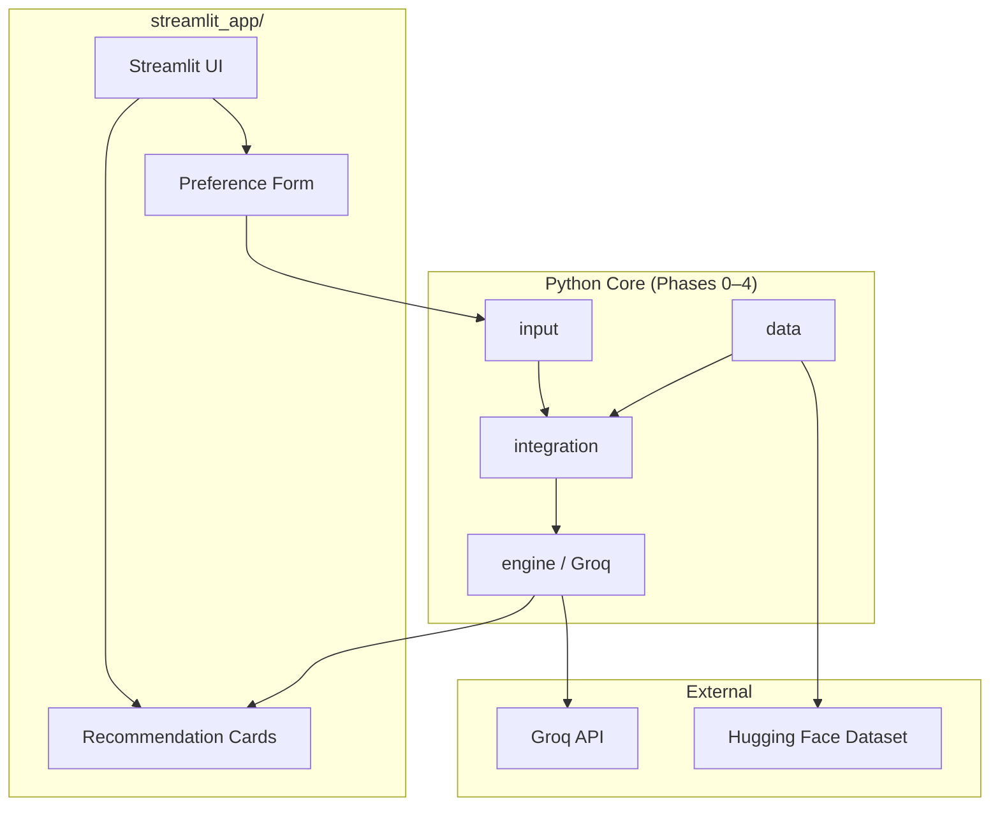
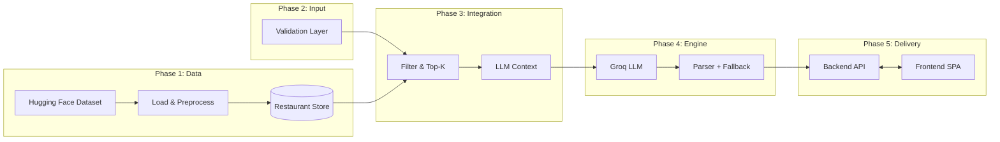
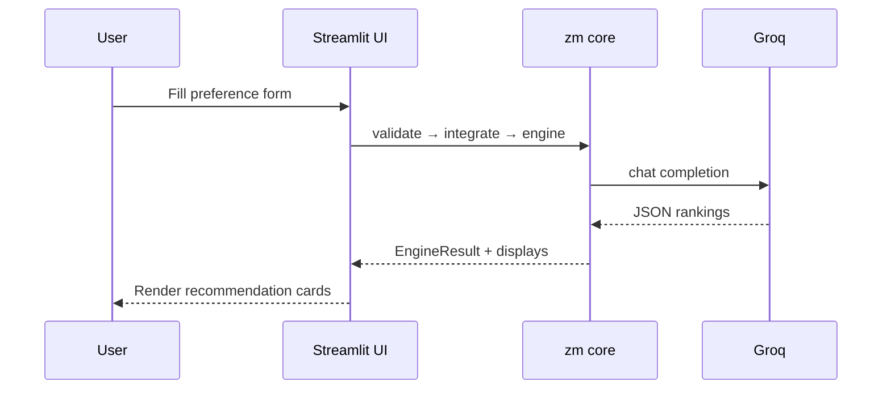
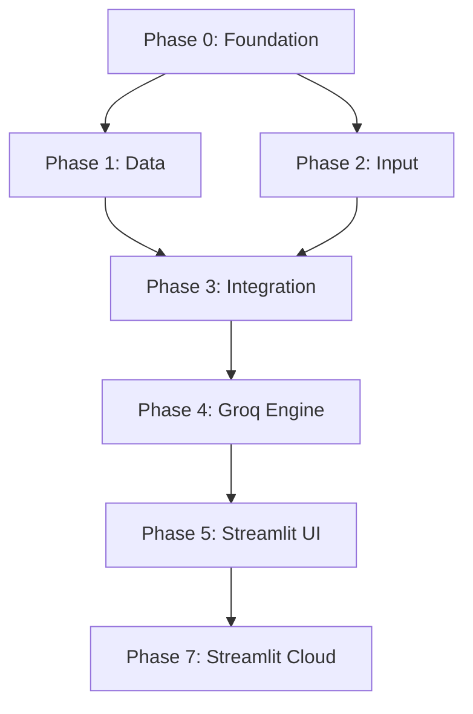

# Phase-Wise Architecture: AI-Powered Restaurant Recommendation System

This document defines a phased architecture for the system described in [Problemstatement1.md](./Problemstatement1.md). Phases **0–4** are implemented in the Python core (`src/zm/`). **Phase 5** is the **Streamlit UI**; **Phase 7** is **Streamlit Community Cloud** deployment.

---

## System Architecture (Production)

### Streamlit single-process app



| Layer | Technology | Responsibility |
|-------|------------|----------------|
| **UI** | Streamlit | Forms, results, loading states |
| **Core library** | `zm` Python package | Data, validation, filters, Groq, enrichment |
| **Data store** | JSONL cache + in-memory repository | Restaurant catalog (Phase 1) |

**Core principle:** Structured data narrows the search space; Groq reasons over a small candidate set. All logic runs in-process — no separate API or SPA host.

---

## High-Level Phase Flow (Logical)



---

## Phase Overview

| Phase | Name | Primary outcome | Depends on |
|-------|------|-----------------|------------|
| 0 | Foundation | Repo, config, contracts | — |
| 1 | Data ingestion | Clean restaurant records in repository | Phase 0 |
| 2 | User input | Validated `UserPreferences` | Phase 0 |
| 3 | Integration layer | Filtered candidates + LLM context | Phases 1, 2 |
| 4 | Recommendation engine | Groq-ranked list + explanations | Phase 3 |
| 5 | Streamlit UI | In-process web app | Phases 1–4 |
| 7 | Cloud deployment | Streamlit Community Cloud | Phase 5 |

**Current implementation status**

| Phase | Status | Location |
|-------|--------|----------|
| 0–4 | Implemented | `src/zm/` |
| 5 | Implemented | `streamlit_app/` |
| 7 | Implemented | [Deployment-Streamlit.md](./Deployment-Streamlit.md), `Dockerfile`, `requirements.txt` |
| Legacy | Available | `src/zm/web/` (Jinja UI, `zm serve`) |

---

## Phase 0: Foundation

**Goal:** Establish project structure, configuration, and shared contracts so later phases integrate without rework.

### Components

| Component | Responsibility |
|-----------|----------------|
| Project scaffold | Python package `zm`, dependency management |
| Configuration | `GROQ_API_KEY`, dataset cache, API/frontend URLs |
| Domain models | `Restaurant`, `UserPreferences`, `Recommendation`, `RecommendationDisplay` |
| Interfaces | Ports for data source, LLM completer, UI (for tests) |

### Deliverables

- Shared types in `src/zm/models/`
- Documented env vars (see [README](../README.md))
- No UI framework locked in Phase 0 (API + SPA decided in Phase 5)

### Exit criteria

- Phases 1–5a import the same models without circular dependencies

---

## Phase 1: Data Ingestion

**Goal:** Load the Zomato dataset from Hugging Face, normalize it, and expose queryable restaurant records.

*Maps to problem statement: **§1 Data Ingestion***

| Component | Responsibility |
|-----------|----------------|
| Dataset loader | Download `zomato.csv` via Hugging Face Hub |
| Preprocessor | Dedupe, skip invalid rows |
| Field normalizer | Map CSV → `Restaurant` |
| Restaurant repository | `filter_by_location()`, `get_known_locations()`, `get_by_id()` |

**Package:** `src/zm/data/`

### Exit criteria

- ≥1 city returns a non-empty restaurant set
- `zm load-data` builds `data/cache/restaurants_v1.jsonl`

---

## Phase 2: User Input

**Goal:** Collect and validate user preferences before any recommendation runs.

*Maps to problem statement: **§2 User Input***

| Component | Responsibility |
|-----------|----------------|
| Validation layer | `validate_form()` / `validate_json()` → `UserPreferences` |
| Location matcher | Known cities + fuzzy suggestions |
| API schemas | `PreferenceFormInput`, error responses |

**Package:** `src/zm/input/`

### Preference schema

| Field | Type | Validation |
|-------|------|------------|
| `location` | string | Required; known city (e.g. Bangalore); area via `additional` |
| `budget` | enum | `low` \| `medium` \| `high` (numeric budget mapped in UI/API) |
| `cuisine` | string or list | At least one cuisine |
| `min_rating` | float | 0–5 |
| `additional` | string | Optional; area (e.g. Bellandur), free-text prefs, max 500 chars |

### Exit criteria

- Invalid input never reaches filter or Groq
- Same validation used by backend API and frontend (server-side authority)

---

## Phase 3: Integration Layer

**Goal:** Reduce the dataset to a relevant candidate set and build LLM-ready context.

*Maps to problem statement: **§3 Integration Layer***

| Component | Responsibility |
|-----------|----------------|
| Hard filters | Location (city), min rating, cuisine OR-match, budget band |
| Soft scoring | Rank by rating + budget fit before Top-K |
| Context packager | JSON with `restaurant_id`, name, cuisine, rating, cost |
| Prompt templates v1 | System + user prompts for Groq |

**Package:** `src/zm/integration/`

### Exit criteria

- Typical query returns 10–30 candidates in &lt;100ms (local data)
- Zero candidates → clear message, **no Groq call**

---

## Phase 4: Recommendation Engine (Groq)

**Goal:** Use **Groq** to rank candidates, explain fit, and optionally summarize.

*Maps to problem statement: **§4 Recommendation Engine***

| Component | Responsibility |
|-----------|----------------|
| Groq client | `llama-3.3-70b-versatile` (configurable), JSON mode, retry |
| Parser | Strip fences, validate IDs against candidates |
| Fallback | Rule-based Top-N if Groq fails or key missing |
| Enricher | `RecommendationDisplay` for UI/API |

**Package:** `src/zm/engine/`

### LLM provider

| Setting | Default |
|---------|---------|
| `GROQ_API_KEY` | Required for AI rankings |
| `GROQ_MODEL` | `llama-3.3-70b-versatile` |

### LLM output schema

```json
{
  "summary": "Optional one-line overview",
  "recommendations": [
    {
      "restaurant_id": "string",
      "rank": 1,
      "explanation": "Why this matches location, budget, cuisine, and extras"
    }
  ]
}
```

### Exit criteria

- Top N results include explanations grounded in preferences
- Hallucinated `restaurant_id` values are dropped (P4-16)

---

## Phase 5: Streamlit UI (production)

**Goal:** Deliver the product through **`streamlit_app/`** — in-process UI calling `src/zm/` (no separate API or SPA).

Production implementation: `streamlit_app/app.py`, `service.py`, `components/`.

Legacy alternative: **`src/zm/web/`** (Jinja, `zm serve`).

*Historical note: an earlier iteration used a split FastAPI backend + Next.js frontend (Vercel/Railway). That stack has been removed; Streamlit is the production path.*

### Interim MVP (legacy)

**`src/zm/web/`** — Jinja form UI (`zm serve`). Same pipeline as Streamlit; kept for local dev only.

---

## Phase 6: Hardening (Optional)

| Area | Examples |
|------|----------|
| Deployment | Docker + volume for `data/cache` |
| Area filter | Bellandur / neighbourhood filter in Streamlit service |
| Budget UX | Numeric budget (₹) mapped to band in UI |

---

## Phase 7: Cloud deployment (Streamlit)

**Goal:** Host the production app on **Streamlit Community Cloud** (`streamlit_app/app.py`).

**Full runbook:** [Deployment-Streamlit.md](./Deployment-Streamlit.md)

| Artifact | Purpose |
|----------|---------|
| `streamlit_app/app.py` | Main file for Streamlit Cloud |
| `requirements.txt` | `-e .` + `streamlit` for pip install |
| `Dockerfile` | Optional container deploy |
| `.streamlit/config.toml` | Theme and server defaults |

### Exit criteria

- App loads cities from in-process repository
- Full recommend flow works with `GROQ_API_KEY` in Secrets
- No secrets in the Git repo

---

## End-to-End Request Flow (Streamlit)



---

## Repository Layout

```
ZM/
├── streamlit_app/           # Phase 5 / 7 — Streamlit UI
├── requirements.txt         # Streamlit Cloud pip install
├── Dockerfile               # Optional Docker (Streamlit)
├── Procfile                 # Optional PaaS start hint
├── src/zm/                  # Phases 0–4 core (library)
│   ├── config/
│   ├── models/
│   ├── data/
│   ├── input/
│   ├── integration/
│   ├── engine/
│   └── web/                 # Legacy Jinja UI (`zm serve`)
├── data/cache/              # Restaurant JSONL cache
├── Docs/
├── scripts/
└── tests/
```

---

## Phase Dependencies (Build Order)



**Recommended order:** 0 → 1 → 2 → 3 → 4 → 5 → 7 (deploy)

---

## Traceability to Problem Statement

| Problem statement section | Architecture phase |
|---------------------------|-------------------|
| Data ingestion | Phase 1 |
| User input | Phase 2 + Phase 5 (form) |
| Integration layer | Phase 3 |
| Recommendation engine | Phase 4 (Groq) |
| Output display | Phase 5 (Streamlit UI) |
| Deployment (production) | Phase 7 (Streamlit Cloud) |

---

## MVP vs Full Build

| Scope | Phases | Stack |
|-------|--------|-------|
| **Production** | 0–7 | Streamlit + `src/zm` core |
| **Legacy local UI** | 0–4 + web | Jinja (`zm serve`) |
| **Local Docker** | 0–7 | `docker compose up` (Streamlit) |

---

## Related documentation

- [Deployment-Streamlit.md](./Deployment-Streamlit.md) — Streamlit Cloud deployment
- [EdgeCases.md](./EdgeCases.md)
